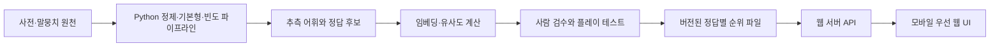

# 한국어 Hot and Cold 개발 계획

작성일: 2026-08-06

## 1. 목표와 전제

비밀 단어와 의미적으로 가까운 단어를 계속 입력하며 정답을 찾아가는 한국어 일일 단어 게임을 만든다. 각 추측에는 원점수보다 이해하기 쉬운 **전체 후보 어휘 중 순위**를 보여 준다.

이 계획은 다음을 전제로 한다.

- 우선 한국 사용자를 위한 독립 웹앱을 만든다.
- 첫 버전의 성공 기준은 기능 수가 아니라 "순위가 납득되고 실제로 풀리는가"이다.
- Reddit의 공개 구현은 참고하되, 영어 어휘 데이터는 한국어로 단순 번역하지 않는다.
- 작업 폴더는 현재 비어 있으므로 새 프로젝트로 시작한다.

사용자가 원하는 것이 Reddit 서브레딧 안에서 실행되는 앱이라면 프런트엔드·배포 계층을 Devvit으로 바꾸면 된다. 데이터 파이프라인과 평가 계획은 그대로 재사용할 수 있다.

## 2. 조사 결과와 제품 방향

Reddit Hot and Cold의 핵심 규칙은 다음과 같다.

1. 하루에 비밀 단어 하나가 공개된다.
2. 사용자는 관련 있다고 생각하는 단어를 자유롭게 입력한다.
3. 시스템은 비밀 단어와의 의미적 관련성을 후보 어휘 전체에서의 순위로 알려 준다.
4. 반의어도 같은 문맥에서 자주 등장하므로 가까울 수 있다.
5. 공개 소스 구현은 약 6.4만 개의 추측 어휘와 약 2,354개의 정답 후보에 대해 정답별 순위를 미리 계산해 정적 데이터로 제공한다.

한국어에는 이미 꼬맨틀 계열 서비스와 뉴맨틀 등이 있다. 따라서 차별점은 단순한 한국어 지원이 아니라 아래 세 가지로 잡는다.

- 활용형·조사·띄어쓰기 차이를 친절하게 처리한다.
- 정답과 상위 근접어를 사람이 검수해 "억지 순위"를 줄인다.
- 추후에는 이상한 순위에 대해 사전 관계나 용례 기반의 짧은 설명을 제공한다.

첫 버전에서는 세 번째 항목을 넣지 않아도 된다. 먼저 순위 품질 자체를 검증한다.

## 3. MVP 범위

### 반드시 포함

- 매일 동일한 비밀 단어 한 개
- 제한 없는 추측
- 추측 단어, 근접 순위, 온도 색상 표시
- 가장 가까운 추측 순 정렬과 입력 순 정렬
- 중복 추측 방지
- 단계별 힌트 2~3개
- 포기 및 정답 공개
- 결과 공유용 텍스트/이모지
- 브라우저 로컬 저장소 기반 시도 기록과 연속 플레이 기록
- 모바일 우선 화면, 키보드 접근성

### MVP에서 제외

- 회원가입과 소셜 로그인
- 실시간 멀티플레이
- 전 세계 순위표
- 생성형 AI가 매 요청마다 계산하는 유사도
- 사용자 제작 문제
- 네이티브 모바일 앱
- 복잡한 운영자 화면

## 4. 게임 규칙 초안

- 정답은 `1위`, 그 외 단어는 정답과 가까운 순서대로 `2위`부터 표시한다.
- 원시 코사인 유사도는 모델마다 분포가 달라 사용자가 해석하기 어렵기 때문에 순위를 주 정보로 사용한다.
- 온도 구간은 고정 유사도 대신 순위 백분위로 정한다. 초기 예시는 아래와 같고 플레이 테스트 후 조정한다.
  - 1위: 정답
  - 2~10위: 매우 뜨거움
  - 11~100위: 뜨거움
  - 101~1,000위: 따뜻함
  - 나머지: 차가움
- 고유명사, 비속어, 조사만 있는 입력, 의미 없는 문자열은 초기 어휘집에서 제외한다.
- 동사·형용사는 기본형을 표준으로 사용한다. `달려요`처럼 명확한 활용형은 `달리다`로 정규화하되, 화면에는 사용자가 입력한 원형도 남긴다.
- 동음이의어는 한 입력으로 처리하되, 정답 후보로는 지배적인 의미가 분명한 단어만 먼저 사용한다. `사과`처럼 의미가 크게 갈리는 단어는 초기 정답에서 제외한다.

## 5. 데이터 확보 계획

| 자료 | 얻을 정보 | 활용 방식 | 주의점 |
|---|---|---|---|
| 국립국어원 한국어기초사전 Open API | 쉬운 표제어, 품사, 뜻풀이 | 초기 추측 어휘와 정답 후보의 중심 자료 | API 이용 조건과 출처 표기 준수 |
| 국립국어원 우리말샘 | 넓은 표제어, 뜻풀이, 비슷한말·관련어 | 어휘 확장, 동의어 별칭, 검수 보조 | 전문어·방언·저빈도어가 많으므로 그대로 정답 풀로 쓰지 않음 |
| 국립국어원 모두의 말뭉치 | 실제 사용 빈도와 문맥 | 저빈도어 제거, 자체 임베딩 실험, 용례 추출 | 자료별 이용 조건 확인, 원문 재배포 금지 여부 확인 |
| fastText 한국어 사전학습 벡터 | 단어별 300차원 벡터 | 가장 빠른 기준 모델 | CC BY-SA 3.0 출처·파생 산출물 조건을 공개 전 확인 |
| 한국어 문장 임베딩 모델 | 뜻풀이·용례의 의미 벡터 | 정의 기반 모델 비교 실험 | 모델 카드의 코드·가중치·학습 데이터 라이선스를 각각 확인 |
| Kiwi/kiwipiepy | 형태소 분석과 기본형 복원 | 데이터 정제 및 입력 별칭 생성 | LGPL v3 조건 검토; 가능하면 런타임이 아니라 오프라인 파이프라인에서 사용 |
| 베타 사용자 로그 | 추측 단어, OOV, 풀이 과정 | 어휘 누락과 어려운 문제 발견 | 고지·보존기간·익명화 후 수집, 원문 입력 최소화 |

상업 공개 가능성을 고려해 `data_sources.yml`에 자료별 URL, 버전, 취득일, 라이선스, 출처 표시 문구, 재배포 가능 여부를 기록한다. 이용 조건이 불명확한 자료는 프로토타입 조사용으로만 쓰고 공개 산출물에는 포함하지 않는다.

## 6. 어휘 데이터 파이프라인

### 6.1 원천 수집

1. 한국어기초사전에서 일반 명사·동사·형용사를 수집한다.
2. 우리말샘의 관련 어휘와 누락된 일상어를 후보로 추가한다.
3. 말뭉치 빈도로 실제 사용 빈도를 붙인다.
4. 각 행에 출처와 라이선스 계보를 남긴다.

### 6.2 정규화

- 유니코드 NFC 정규화
- 앞뒤 공백과 연속 공백 정리
- 사전의 `^`, `-` 같은 분석 기호를 원형 필드와 표시 필드로 분리
- 동사·형용사 기본형 통일
- 활용형, 허용 띄어쓰기, 흔한 철자 변형을 별칭 테이블로 분리
- 숫자·기호·한 글자 기능어·조사·어미 제거
- 동일 표제어의 여러 품사와 의미 번호 유지

### 6.3 추측 어휘와 정답 어휘 분리

- **추측 어휘**: 초기 15,000~30,000개. 사용자가 입력할 수 있는 폭을 넓게 잡는다.
- **정답 어휘**: 초기 후보 300개, 실제 출시 전 사람 검수를 통과한 60~100개. 일상성·단일 의미성·풀이 가능성을 엄격하게 본다.

정답 후보 필터 예시는 다음과 같다.

- 말뭉치 빈도가 너무 낮지 않음
- 특정 세대·지역·직업만 아는 전문어가 아님
- 고유명사·상표·시사 의존어가 아님
- 혐오·성적·의학적 민감어가 아님
- 상위 근접어에 서로 다른 접근 경로가 존재함
- 형태만 비슷한 단어가 상위권을 독점하지 않음

### 6.4 권장 파일 구조

```text
data/
  sources/data_sources.yml
  raw/                    # Git 제외, 원천별 보관
  interim/lexicon.parquet
  curated/guess_words.parquet
  curated/target_words.csv
  aliases.csv
  evaluations/neighbor_review.csv
  releases/v1/
    dictionary.bin
    puzzles/
    schedule.csv
```

`lexicon.parquet`의 주요 필드는 `word_id`, `lemma`, `display`, `pos`, `sense_id`, `definition`, `frequency`, `aliases`, `source_id`, `guess_allowed`, `target_allowed`, `review_status`로 한다.

## 7. 유사도 모델 개발 계획

처음부터 복잡한 앙상블을 만들지 않고 아래 모델을 같은 평가 세트에서 비교한다.

### 기준 모델 A: fastText 단어 벡터

- 장점: 구현이 빠르고 전체 어휘의 순위를 한 번에 계산하기 쉽다.
- 장점: 부분 단어와 미등록어에 비교적 강하다.
- 단점: 동음이의어가 한 벡터에 섞이고, 철자 형태가 비슷한 단어가 과대평가될 수 있다.

### 후보 모델 B: 한국어 문장 임베딩으로 표제어만 임베딩

- 빠르게 비교할 수 있지만, 문장용 모델에 한 단어만 넣으면 기대보다 나쁠 수 있다.
- 모델 이름만 보고 채택하지 않고 실제 이 게임의 근접어 품질로 판단한다.

### 후보 모델 C: 사전 뜻풀이 임베딩

- `표제어 + 품사 + 뜻풀이`를 일정한 템플릿으로 만들어 임베딩한다.
- 정답은 검수된 특정 의미를 사용하고, 추측어가 다의어이면 각 의미 중 가장 높은 점수를 사용한다.
- 품질은 좋아질 가능성이 있지만 계산량과 데이터 라이선스 검토량이 늘어난다.

### 채택 순서

1. A로 플레이 가능한 프로토타입을 만든다.
2. 동일한 50개 정답에 대해 A/B/C의 상위 100개 이웃을 생성한다.
3. 사람이 평가한 결과에서 C가 명확하게 이길 때만 C로 이동한다.
4. 하나의 모델로 부족하다는 증거가 있을 때만 말뭉치 벡터, 뜻풀이 벡터, 사전 관계를 조합한다.

점수는 후보 어휘 전체에 대해 코사인 유사도를 계산하고 내림차순 정렬해 만든다.

```text
rank(guess, target)
  = 1 + count(score(other, target) > score(guess, target))
```

동점일 때는 `word_id` 순으로 고정해 같은 데이터 버전에서 결과가 항상 같게 한다.

## 8. 모델과 문제 품질 평가

### 오프라인 평가

- 정답 50개 × 각 모델의 상위 근접어 30개를 블라인드 검수
- 평가 등급: `2 = 자연스럽게 관련`, `1 = 설명하면 관련`, `0 = 납득 어려움`
- 최소 3명의 평가자 사용
- 지표:
  - 상위 10/30 평균 관련성
  - 상위 30의 `0점` 비율
  - 철자 유사어·고유명사·중복 활용형 비율
  - 평가자 간 일치도

### 플레이 평가

- 10~20명의 테스터가 검수 후보 문제를 실제로 풂
- 지표:
  - 정답률
  - 정답까지 중앙 추측 횟수
  - 100회 이상 추측 또는 포기 비율
  - 입력했지만 사전에 없는 단어 비율(OOV)
  - "순위가 납득되지 않음" 신고율
  - 첫 힌트 사용률

초기 통과 기준 초안:

- 상위 30의 `0점` 비율 10% 이하
- 베타 정답률 70~90%
- OOV 비율 5% 이하
- 한 문제에서 다수 테스터가 같은 이상 순위를 신고하면 해당 문제 보류

정답률이 지나치게 높으면 너무 직접적인 이웃이 많고, 지나치게 낮으면 탐색 경로가 없을 가능성이 있다. 두 경우 모두 정답 후보를 다시 검수한다.

## 9. 시스템 구조



### 권장 기술 구성

- 웹앱: Next.js + TypeScript
- 데이터 파이프라인: Python, pandas/polars, numpy, pyarrow, scikit-learn 또는 faiss
- 형태소 처리: kiwipiepy
- 테스트: Vitest/Playwright, Python pytest
- 초기 저장: 버전된 서버 전용 정적 바이너리 파일
- 운영 데이터가 필요해질 때: PostgreSQL
- 큰 모델·원천 데이터: Git에 직접 넣지 않고 객체 저장소 또는 별도 다운로드 스크립트 사용

초기에는 별도 Python API 서버를 두지 않는다. 순위는 미리 계산하고 Next.js 서버가 단어 ID로 조회한다. 이렇게 하면 요청마다 모델 추론 비용이 없고 같은 입력에는 항상 같은 답이 나온다.

### 요청 흐름

1. 클라이언트가 원문 추측을 서버에 전송한다.
2. 서버가 별칭 테이블로 기본형과 `word_id`를 찾는다.
3. 오늘 문제의 순위 배열에서 해당 `word_id`의 순위와 점수를 읽는다.
4. 정답 문자열은 보내지 않고 순위·온도·정규화된 표시어만 반환한다.
5. 브라우저는 추측 기록과 공유 결과를 저장한다.

정답별 전체 순위 파일을 브라우저에 내려보내면 정답을 쉽게 추출할 수 있으므로 서버 전용으로 둔다. 게임 특성상 완전한 부정행위 방지는 불가능하지만 정답이 정적 번들에 노출되는 것은 피한다.

## 10. 개발 단계와 완료 기준

### 단계 0: 데이터·모델 스파이크

- 5,000~10,000개 어휘, 정답 20개로 A/B/C 비교
- 산출물: 모델 비교 노트북 또는 스크립트, 상위 근접어 검수표
- 완료 기준: 최소 하나의 모델이 10개 이상의 문제에서 사람이 풀 만한 근접어를 제공

### 단계 1: 데이터 파이프라인 v1

- 수집, 정규화, 별칭, 빈도, 출처 계보를 재현 가능한 명령으로 구축
- 산출물: 어휘 릴리스와 데이터 카드
- 완료 기준: 같은 입력과 버전으로 동일한 파일 해시가 생성되고 중복·금지어 검사가 통과

### 단계 2: 로컬 게임 MVP

- 입력, 순위, 힌트, 포기, 공유, 로컬 기록 구현
- 산출물: 모바일에서 실행 가능한 웹앱
- 완료 기준: 정답/미등록어/활용형/중복 입력/날짜 변경 테스트 통과

### 단계 3: 콘텐츠 검수와 비공개 베타

- 정답 후보 60~100개를 검수하고 실제 풀이 로그 수집
- 완료 기준: 앞서 정한 정답률·OOV·이상 순위 기준 통과

### 단계 4: 공개 베타

- 오류 신고, 최소 분석 지표, 캐시와 배포 자동화 추가
- 완료 기준: 30일치 검수 문제가 예약되고 데이터 버전 롤백이 가능

### 단계 5: 증거가 있을 때만 확장

- 계정·연속 기록 동기화
- 과거 문제와 연습 모드
- 친구방 또는 커뮤니티 힌트
- 이상한 순위 설명
- 운영자용 문제 검수 화면

## 11. 테스트 계획

- 정규화 단위 테스트: NFC, 공백, 활용형, 별칭, 동음이의어
- 데이터 계약 테스트: 필수 필드, 중복 ID, 출처 누락, 금지어, 정답의 어휘집 포함 여부
- 순위 테스트: 정답 1위, 동점 결정성, 모델 버전 고정
- API 테스트: 미등록어, 중복, 날짜 경계(Asia/Seoul), 정답 비노출
- E2E 테스트: 첫 추측부터 정답·공유까지, 모바일 뷰포트, 새로고침 복구
- 회귀 테스트: 검수 완료된 정답의 상위 30개가 모델 업데이트 후 얼마나 바뀌었는지 비교

## 12. 주요 위험과 대응

| 위험 | 대응 |
|---|---|
| 의미보다 철자나 브랜드가 상위권을 차지함 | 정답별 상위 이웃 검수, 문제 제외, 필요 시 정의 기반 모델 비교 |
| 활용형·띄어쓰기 때문에 정상 단어를 거절함 | 별칭 맵과 형태소 분석, OOV 로그로 반복 보완 |
| 동음이의어로 순위가 이상함 | 초기 정답에서 제외, 이후 의미 단위 임베딩 도입 |
| 데이터·모델 라이선스가 불명확함 | 원천별 계보 문서화, 공개 전 라이선스 검토, 불명확 자료 제거 |
| 정답 파일이 클라이언트에 노출됨 | 순위 조회를 서버에서 수행, 서버 전용 데이터 사용 |
| 모델 변경으로 예전 문제 순위가 달라짐 | 문제마다 `data_version`과 `model_version` 고정 |
| 매일 수동 운영이 필요함 | 30일 이상 검수 문제를 미리 예약하고 자동 날짜 선택 |
| 기존 한국어 게임과 차이가 약함 | 한국어 입력 관용성, 검수 품질, 커뮤니티형 기능 중 실제 반응이 좋은 하나에 집중 |

## 13. 첫 구현에서 만들 저장소 구성

```text
kor_hot_and_cold/
  apps/web/                # Next.js 웹앱과 서버 API
  pipeline/                # Python 수집·정제·임베딩·릴리스
  data/                    # 원천 메타데이터와 작은 검수 파일만 추적
  tests/fixtures/          # 재현 가능한 소형 데이터
  docs/
    PROJECT_PLAN.md
    DATA_CARD.md
    MODEL_EVALUATION.md
  README.md
```

모노레포 도구나 공용 패키지는 실제 중복이 생기기 전에는 추가하지 않는다.

## 14. 바로 다음 작업

다음 개발 턴에서는 전체 웹앱을 먼저 만들지 말고 **단어 5,000개와 정답 20개로 모델 스파이크**를 수행한다.

1. 한국어기초사전 API 키와 사용할 수 있는 말뭉치 범위를 확인한다.
2. `data_sources.yml`과 작은 어휘 샘플을 만든다.
3. fastText 기준 모델과 정의 임베딩 후보 하나의 상위 근접어를 출력한다.
4. `neighbor_review.csv`에서 사람이 블라인드 비교한다.
5. 채택 모델이 정해진 뒤에만 Next.js 뼈대를 만든다.

이 순서를 따르면 화면을 완성한 뒤 핵심 유사도 품질이 나빠 전체를 다시 만드는 위험을 줄일 수 있다.

## 15. 참고 자료

- Reddit Hot and Cold 앱 설명: https://developers.reddit.com/apps/hotandcold-app
- Reddit 공개 소스(BSD-3-Clause): https://github.com/reddit/devvit-HotAndCold
- 한국어기초사전 Open API: https://krdict.korean.go.kr/kor/openApi/openApiInfo
- 우리말샘: https://opendict.korean.go.kr/main
- 모두의 말뭉치 Open API: https://kli.korean.go.kr/openapi/openapiguide.do?lang=ko
- fastText 한국어 벡터: https://fasttext.cc/docs/en/pretrained-vectors
- Kiwi 형태소 분석기: https://github.com/bab2min/Kiwi
- 뉴맨틀: https://www.newmantle.kr/

